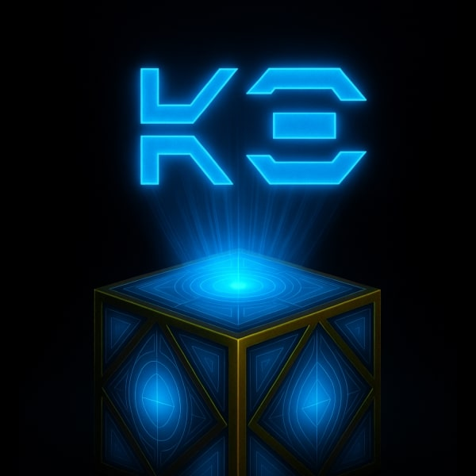

# Aurebesh Droid - Discord Bot

**Aurebesh Droid** is a fully functional Discord bot that brings the iconic Star Wars writing system, **Aurebesh**, to life. Inspired by the droids and datapads of the Star Wars universe, it serves as a language translator, an immersive lore companion, and a platform for Star Wars-inspired features.

The bot includes dynamic **Jedi and Sith holocrons** that unlock hidden wisdom from across the galaxy, adding a rich layer of interactivity and mystery to the experience.

Created by **Abubakr Elmallah** on **June 18, 2025**.

[**Add Aurebesh Droid to Your Discord Server**](https://discord.ly/aurebesh-droid)

<a href="https://discord.ly/aurebesh-droid">
  
</a>

## Features

- `/translate` — Convert English text to **Aurebesh**.
- `/aurebesh` or `/alphabet` — View the **Aurebesh alphabet chart**.
- `/holocron`, `/holocron_jedi`, `/holocron_sith` — Unlock secrets from Jedi and Sith Holocrons with randomized lore quotes.
- **Image Rendering** — Renders translated text into high-quality PNGs using Aurebesh fonts.

## Getting Started

1. **Install CMake & a C++20-Compatible Compiler**
   Make sure you have a C++20-compatible compiler (like AppleClang or g++) and [CMake](https://cmake.org/) installed.
   On macOS with Homebrew:

   ```bash
   brew install cmake
   ```

2. **Clone and Build the Project**:

   ```bash
   git clone https://github.com/theabubakrabu/aurebesh-droid.git
   ```

3. **Create a `.env` File**
   In the root of the project (same level as `src`), create a file named `.env` and paste your Discord bot token into it:

   ```
   DISCORD_TOKEN=token
   ```

4. **Run the Bot**:

   ```bash
   ./run-dev.sh
   ```

### Deploy to Heroku

If you'd prefer to use a precompiled Linux binary and deploy directly, see the [Aurebesh Droid Heroku Repository](https://github.com/TheAbubakrAbu/Aurebesh-Droid-Heroku).

## Privacy & Data

**Aurebesh Droid** respects your privacy:
* **No Personal Data Collected or Stored** – The bot does not save any user data.
- **Secure & Compliant** – Fully adheres to Discord’s Terms of Service and Privacy Policy.

## License

This project is licensed under the [MIT License](LICENSE). Feel free to use, modify, and distribute the code, but please provide attribution.

## Feedback

I would love to hear your thoughts and suggestions! Feel free to open an issue or contact me.

## Contact

For feedback, feature requests, or questions, feel free to reach out:
- **Email**: ammelmallah@icloud.com
- **Website**: [abubakrelmallah.com](https://abubakrelmallah.com/)
- **LinkedIn**: [linkedin.com/abubakr](https://www.linkedin.com/in/abubakr-elmallah-416a0b273/)

Created by **Abubakr Elmallah**